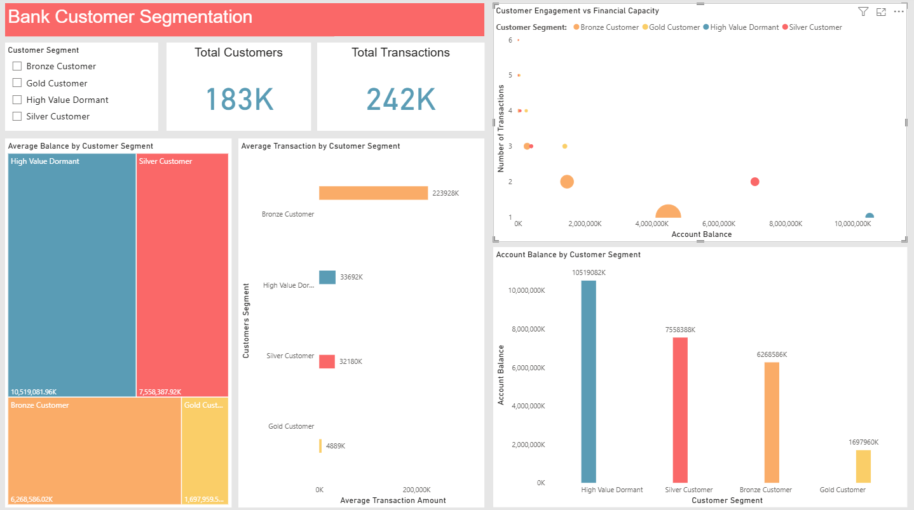

# Bank Customer Segmentation for Personalized Financial Products
## Project Overview

This project focuses on customer segmentation for a digital financial services company using transaction behavior and account balance data.
The goal is to move away from one-size-fits-all marketing and enable data-driven personalization of financial products such as credit cards, loans, savings, and investment offerings.

The analysis converts transaction-level banking data into customer-level insights and identifies actionable customer segments that can directly inform business and marketing decisions.

## Business Problem
### Financial institutions often struggle with:
- Low product adoption
- Poor marketing ROI
- Over-targeting low-value customers
- Under-engaging high-value customers

## Dataset Description

Granularity: Transaction-level
Size: ~1M+ transaction records

Key Columns:
- CustomerID
- TransactionID
- TransactionAmount
- TransactionDate
- CustAccountBalance
- CustGender
- CustLocation

### Tools & Technologies Used
- Excel – Initial data cleaning and validation
- SQL – Customer-level aggregation & segmentation logic
- Power BI – Exploratory Data Analysis (EDA) & visualization

## Methodology (End-to-End)
### 1) Data Preparation
- Cleaned and formatted raw transaction data
- Ensured correct data types and removed invalid values

### 2) Customer-Level Aggregation (SQL)
- Converted transaction-level data into one row per customer using:
- Total Transactions → Customer engagement
- Average Transaction Amount → Spending behavior
- Max Account Balance → Financial capacity

### 3) Rule-Based Customer Segmentation

Customers were segmented using business-friendly rules (no ML black box):
<table>
<tr>
<th>Segment</th><th>Definition</th>  
</tr>
<tr>
<td>Gold Customer</td><td>High engagement, high spending, high balance</td>  
</tr>
<tr>
<td>Silver Customer</td><td>Moderate engagement and financial strength</td>  
</tr>
<tr>
<td>High Value Dormant</td><td>High balance but very low engagement</td>  
</tr>
<tr>
<td>Bronze Customer</td><td>Low engagement and low financial capacity</td>  
</tr>
</table>
	
Power BI Dashboard

Key Visuals:
- Customer distribution by segment
- Total account balance by segment
- Scatter plot: Engagement vs Financial Capacity
- KPI cards: Total Customers, Total Transactions
- Segment slicer for interactivity

Key Findings & Insights
### 1. Majority of customers are low-value
- Bronze customers dominate in count
- But contribute significantly less to total balances
### <i>Implication: Mass campaigns here yield low ROI.</i>

### 2. High-Value Dormant customers hold disproportionate wealth

- Small in number
- Hold large share of total account balance
- Very low transaction activity

### <i>Implication: Major untapped revenue opportunity.</i>

### 3. Engagement ≠ Financial Capacity
- Some customers transact frequently but have low balances
- Others have high balances but barely engage
### <i>Implication: Product strategy must differ by segment.</i>

## Business Recommendations
## For High Value Dormant Customers
### Products:
- Investment products
- Fixed deposits
- Wealth advisory
- Relationship manager outreach

Goal: Activate idle capital

## For Silver Customers
### Products:
- Credit cards
- Personal loans
- Cross-sell savings & investment products

Goal: Increase product depth

## For Bronze Customers
### Products:
- Entry-level credit cards
- BNPL / micro-loans
- Cashback & reward programs

Goal: Improve engagement efficiently

## For Gold Customers
### Products:
- Premium credit cards
- Wealth management
- Loyalty & retention programs

Goal: Retain & maximize lifetime value

